# Newbie's 1984 V65 Sabre Build Images

Source thread: [Newbie's '84 V65 Sabre](https://v4musclebike.com/threads/newbies-84-v65-sabre.25947/)  
Forum: V4MuscleBike  
Downloaded: 2026-04-29  
Local archive: 444 images, about 84 MB

These images are preserved as a local reference for the Sugarkryptonite 1984 V65 Sabre cafe/streetfighter build. The files are numbered in thread order, across pages 1-10. Some original forum image proxies were dead, so missing proxy images were recovered through the original Imgur `data-url` links where available.

Technical build notes: [Tuning/newbies-84-v65-sabre-build.md](../../../Tuning/newbies-84-v65-sabre-build.md)

Source map: [source-manifest.tsv](source-manifest.tsv)

## Selected Preview

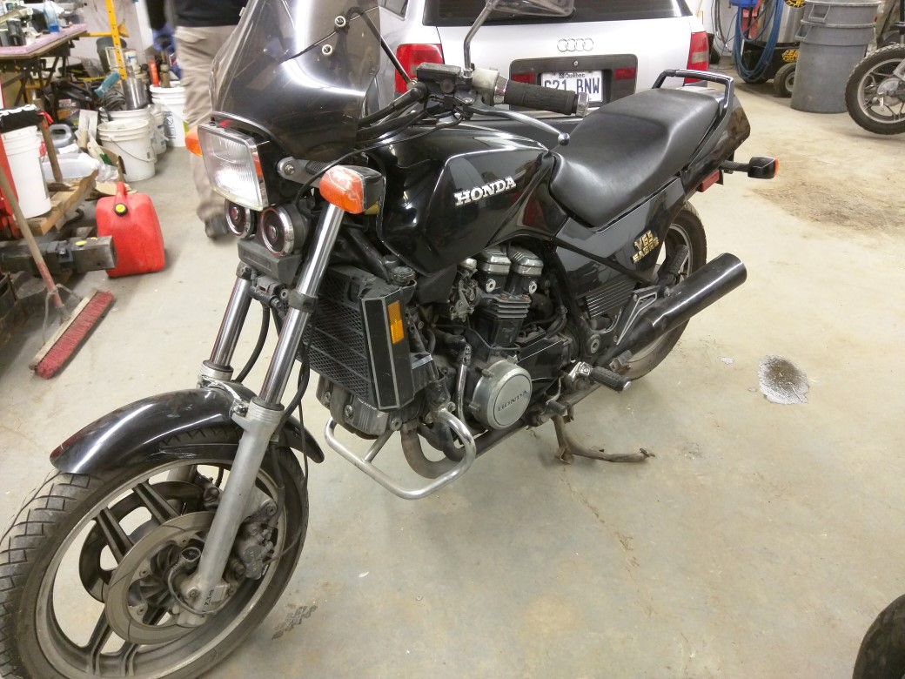
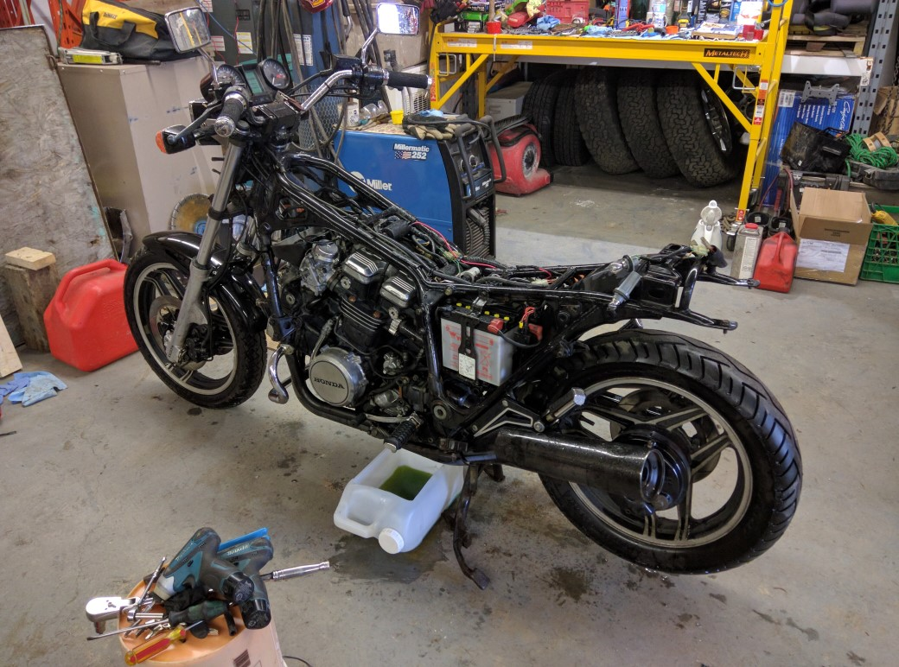

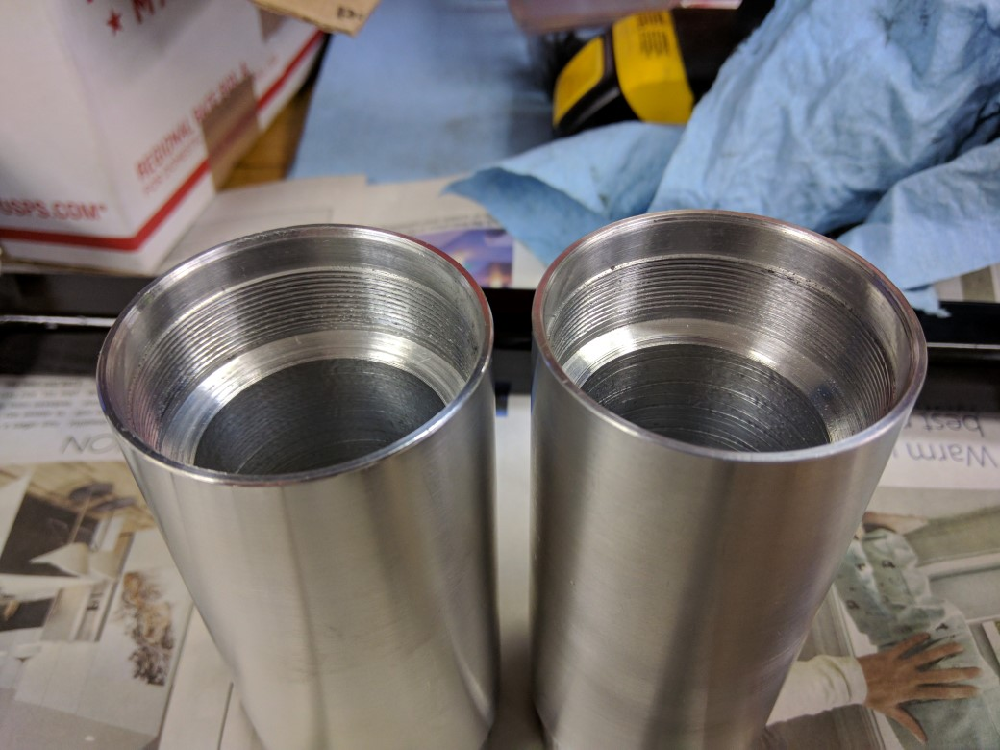
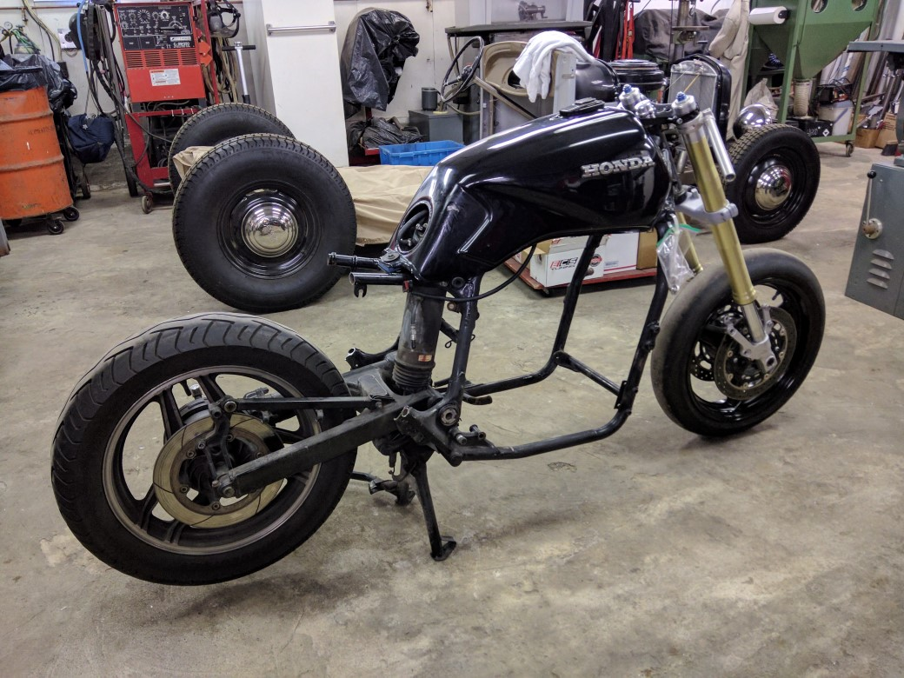
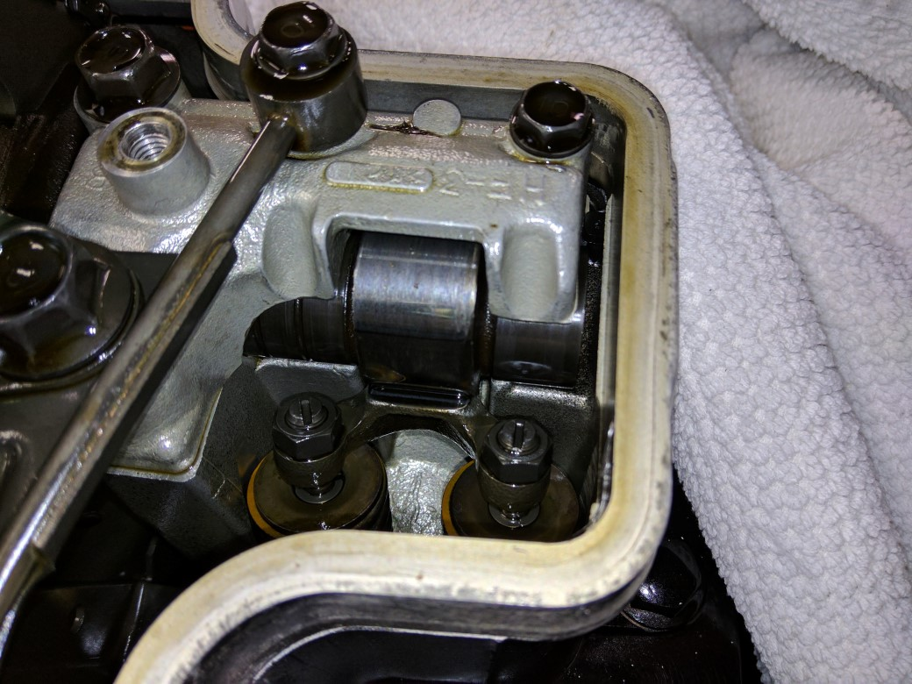
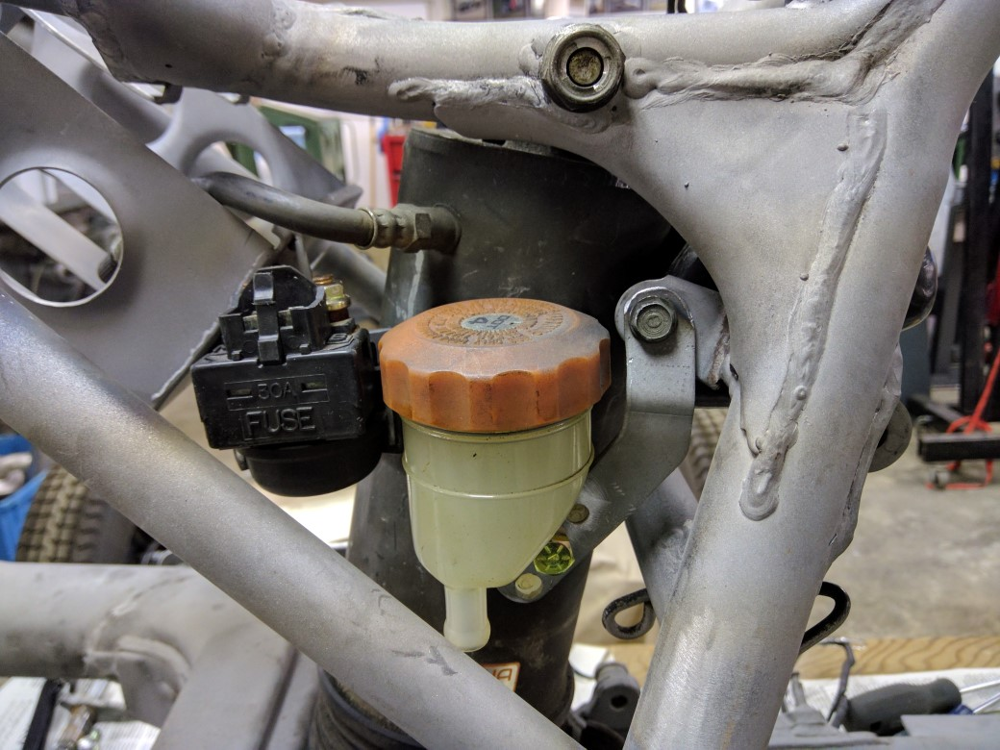
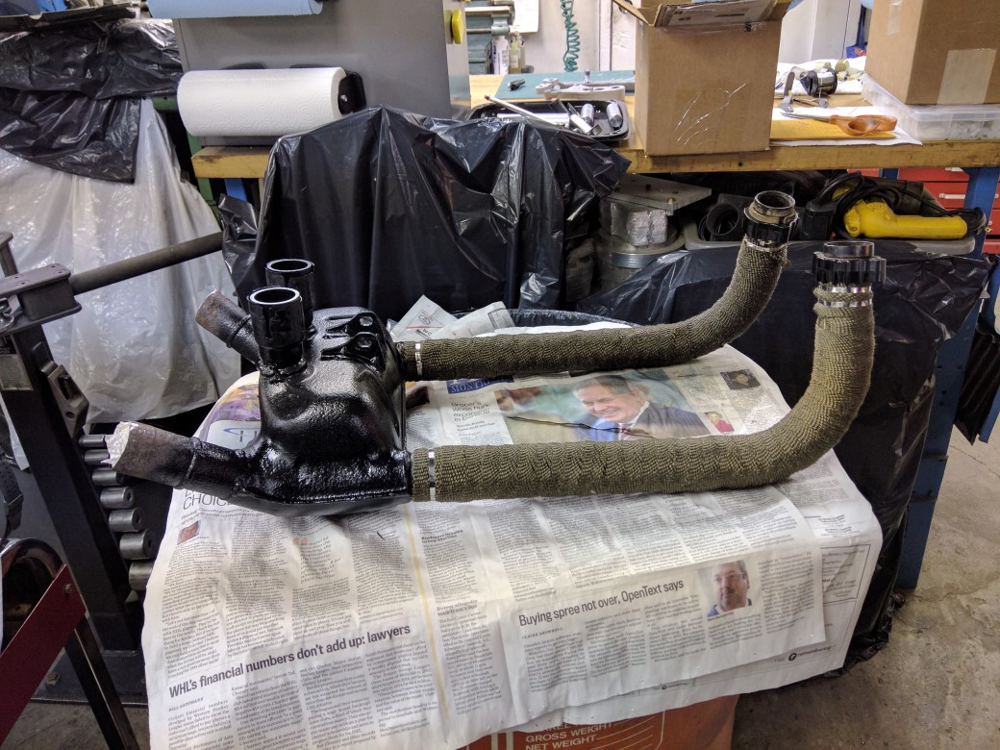
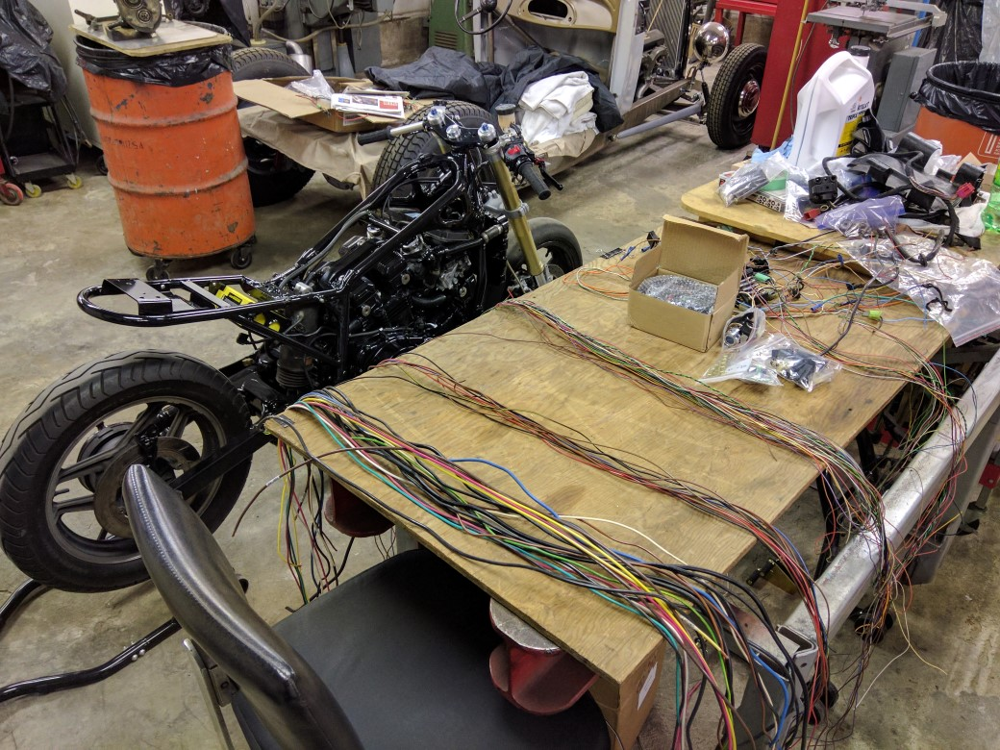
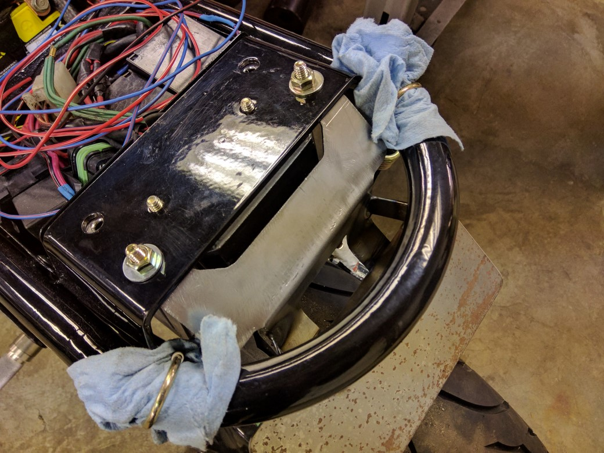
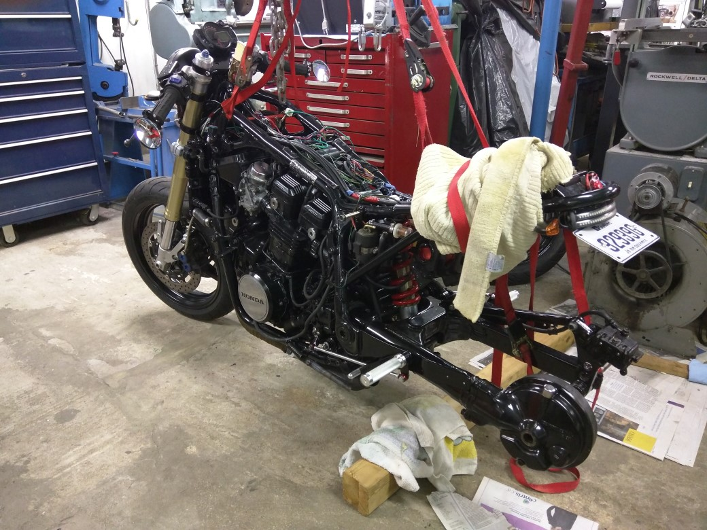
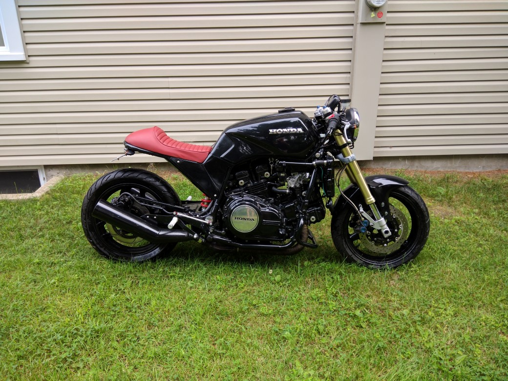
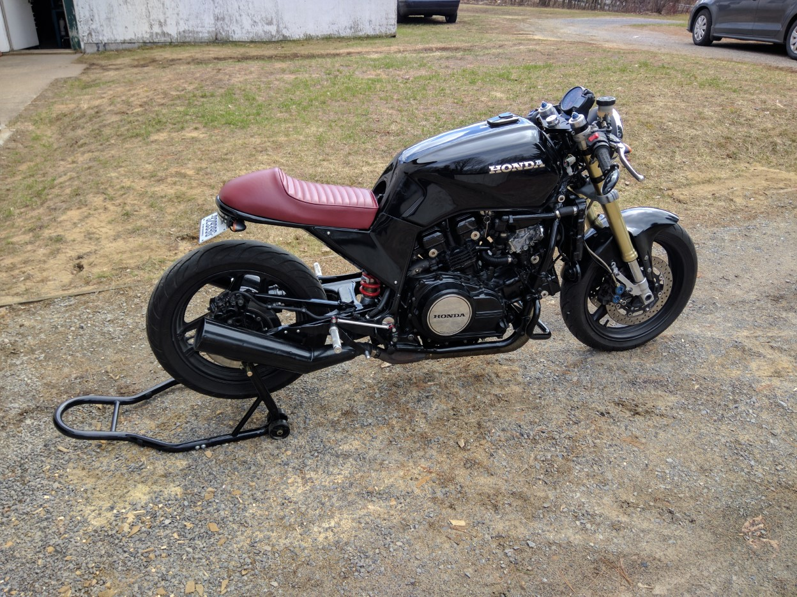

